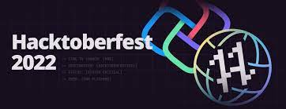

# Hactoberfest22
## KickStart to Open Source Event 

## What is Hacktoberfest?
A month-long celebration from October 1st - 31st sponsored by [Digital Ocean](https://hacktoberfest.digitalocean.com/) and [GitHub](https://github.com/blog/2433-celebrate-open-source-this-october-with-hacktoberfest) to get people involved in [Open Source](https://github.com/open-source). Create your very first pull request and contribute to the open source developer community.

## How to contribute to this repository
* Fork this repository (Click the Fork button in the top right of this page, then click at your profile)
* Clone your fork down to your local machine

```markdown
git clone https://github.com/your-username/hacktober-fest.git
```

* Complete the task. (Details of the task are provided in the section below)
* Commit and push

```markdown
git add .
git commit -m "Commit message"
git push origin branch-name
```

* Create a new pull request from your forked repository (Click the `New Pull Request` button located at the top of your repo)
* Wait for your PR review and merge approval!
* __Star this repository__ if you had fun!


## Task Details/Problem Statements
### A. Web Development.
* 1. Design a Interactive Webpage which fetches News using News API
* 2. Design User Interface for a static Blog Website  
* 3. A Quiz Web-App using React.js

### B. App Development.
* 1. Create a password manager app
* 2. Medicine tracker/ Reminder app
* 3. Food Ordering app

### C. Programming Questions
* 1. Do simple questions on pattern, conditionals, loops, Maths etc.

### F. UI Design
* 1. If you have any UI of an app/web and want to do open source then you can add your design in this folder.

## Rules for making PULL REQUEST

* 1. Except for DSA you have to add folder (not files) as a solution in the respective fodlers

* 2. For programming questions add files (any language) into the respective folder

* 3. Last step is to add your name and details in the md file in the respective folder
